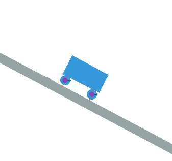

# PhysicsProject

I made this project for a mechanic physics presentation, I used the pymunk library to do it, go check it if you need it (https://www.pymunk.org/en/latest/), it's all about the time it takes for a vehicle to stop depending on the surface friction.

I worked hard on it because I'm not that good with python, I know the basics, but i learned how to do it with the official pymunk documentation and applying physics concepts.

